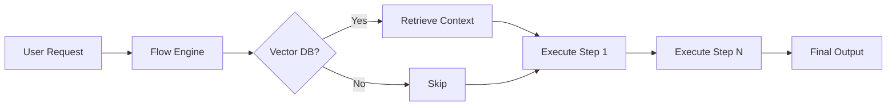

# Ollama Agent Setup Kit

This repository provides a complete framework for building multi-agent workflows using local LLMs via Ollama.

## Quick Links

- [Quick Start](QUICKSTART.md) - Get up and running in 5 minutes
- [Configuration Reference](CONFIG.md) - All environment variables explained
- [Examples](EXAMPLES.md) - Ready-to-use workflow templates
- [API Reference](API.md) - Technical integration guide

## Core Architecture

```
User Request → Flow Engine → Vector DB (optional) → Agent Steps → Output
                  │
            ┌──────┴───────┐
            ↓              ↓
       Step Context      Model Selection
```

### Pipeline Overview



## Available Workflows

### Development Pipeline (`dev_workflow`)

A complete software development workflow:

1. **Analyst** - Break down requirements
2. **Architect** - Design system architecture
3. **Developer** - Generate code implementation
4. **Reviewer** - Code review and quality assurance

```bash
python main.py --flow dev_workflow --request "Build a REST API for task management"
```

### Blog Content Workflow (`blog_workflow_with_context`)

Content creation with RAG (Retrieval Augmented Generation):

1. **Research** - Gather background info from vector DB
2. **Outline** - Create structure using templates
3. **Draft** - Write full content
4. **Review** - Polish and finalize

```bash
python main.py --flow blog_workflow_with_context --request "Write about machine learning"
```

## Getting Started

### 1. Clone and Setup

```bash
git clone [repo-url]
cd ollama-simple-agents

# Create virtual environment
uv sync

# Copy and edit environment template
cp .env.example .env
nano .env  # Configure your models
```

### 2. Start Ollama

```bash
ollama serve &

# Pull recommended models
ollama pull llama3.1:8b
ollama pull qwen2.5-coder:7b
```

### 3. Run Your First Workflow

```bash
python main.py --flow dev_workflow --request "Create a blog post about AI"
```

## For Coding Assistants

This repo can be pointed to by coding assistants (GitHub Copilot, Cursor, etc.) for agent setup:

| What the assistant needs | Where to find it |
|--|--|
| How to add new agents | See `agents/` + [CONFIG.md](CONFIG.md) |
| Available models | Run `python main.py --list-models` or check `.env.example` |
| Workflow configuration | See `config/flows/` + [EXAMPLES.md](EXAMPLES.md) |
| Vector DB setup | See [CONFIG.md](CONFIG.md) section on vector databases |

## Documentation Index

| File | Purpose |
|--|--|
| [QUICKSTART.md](QUICKSTART.md) | Minimal setup guide |
| [CONFIG.md](CONFIG.md) | Complete configuration reference |
| [EXAMPLES.md](EXAMPLES.md) | 10+ ready-to-use workflows |
| [API.md](API.md) | Technical developer reference |
| [AGENT_PATTERNS.md](AGENT_PATTERNS.md) | Design guidelines for agents |
| `dev_tools/` | Helper scripts |

## License

MIT - Feel free to use this framework for your own projects.